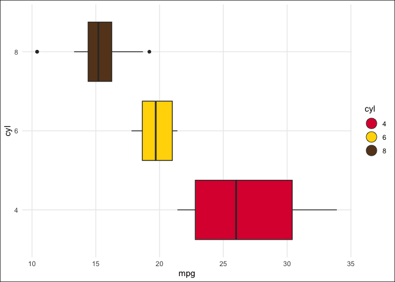
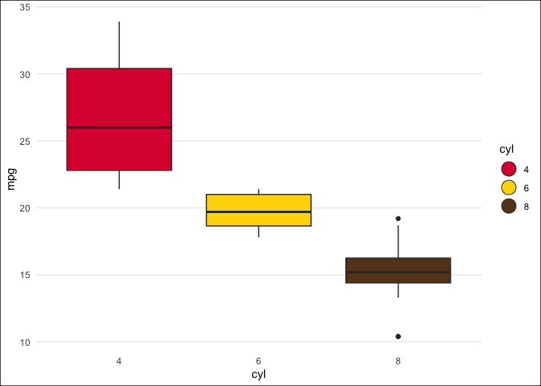

<!-- README.md is generated from README.Rmd. Please edit that file -->

# minithemes

The minithemes package provides some simple themes, and palettes for
ggplot2, including conditional themes that optimize grid lines and
palettes and key glyph markers from W.E.B. Dubois’s visualizations.

## Installation

You can install the development version of minithemes from
[GitHub](https://github.com/) with:

``` r
# install.packages("remotes")
remotes::install_github("jmclawson/minithemes")
```

## Example

This is a basic example which shows you how to solve a common problem:

``` r
library(minithemes)
library(dplyr)
library(ggplot2)

# Showing automated grid lines, Dubois key glyphs, and Dubois palette.
mtcars |>
  mutate(cyl = factor(cyl)) |>
  ggplot(aes(mpg, cyl, fill = cyl)) +
  geom_boxplot(key_glyph = "dubois") +
  theme_mini() +
  scale_fill_dubois()
```



``` r

# Conditional grid lines toggle for both orientations.
mtcars |>
  mutate(cyl = factor(cyl)) |>
  ggplot(aes(cyl, mpg, fill = cyl)) +
  geom_boxplot(key_glyph = "dubois") +
  theme_mini() +
  scale_fill_dubois()
```


